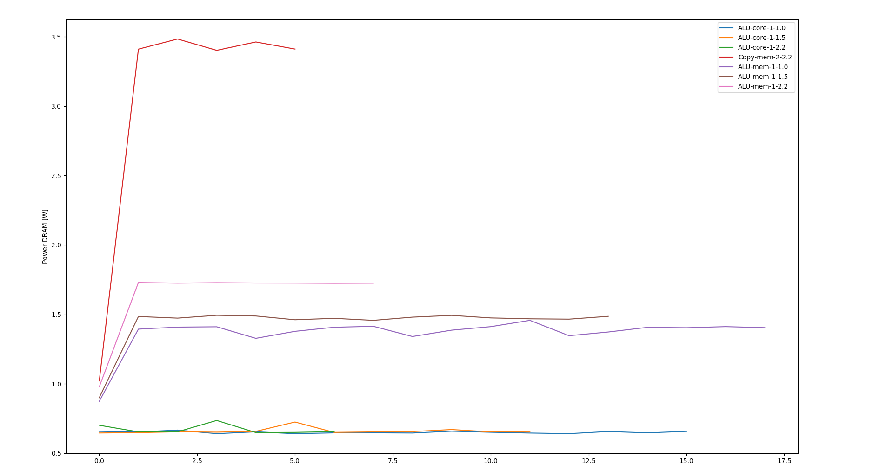
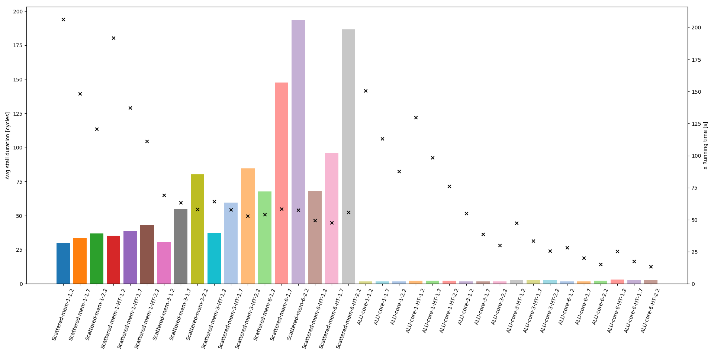

---
author:
- 'Beatrice Bevilacqua, Anxhelo Xhebraj'
date: March 2019
title: 'Performance counters analysis for Hyper-Threading'
---

Performance counters analysis for Hyper-Threading
=================================================


Performance Counters Frameworks
-------------------------------
The complexity of newer architectures has led to the necessity of
a better knowledge of the underlying hardware in order to get peak
performance. Following these trends new interfaces have been made
available to developers for spotting performance bottlenecks in their
applications such as Performance Monitoring Units (PMU).

PMUs enable developers to observe and count events in the CPU such as
branch mispredictions, cache misses and other finer grained details over
the whole pipeline. Although powerful, dealing with such information
remains burdensome given the diversity of the events, making it difficult
to truly identify optimization opportunities.
Depending by the processor family, on average 4 counters can be read
contemporarily at any time using Model Specific Registers. In order
to read more than 4 events, various tools multiplex such registers
in a *time-sharing* fashion.

Many tools for performance analysis based on PMUs have been developed
ranging from *raw* event count to more sofisticated and aggregated
measures as follows:

* `msr`: direct access to the device files `/dev/cpu/*/msr`
* [PAPI] : A Performance Application Programming Interface that
  offers a set of APIs for using performance counters.
  Supports multiple architectures and multiplexing.
* [likwid] : A suite of applications and libraries for analysing
  High Performance Computing applications. It
  contains out of the box utilies to work with MPI,
  power profiling and architecture topology.
* [Intel Vtune Amplifier] : Application for performance analysis on
  intel architectures. Gives insights regarding possible bottlenecks
  of the application annotating its source code and provides
  possible solutions.
* [perf] : In a similar vein to Intel Vtune Amplifier shows which
  functions are more critical to the application. Additionally
  provides more high level information such as I/O and Networking.
  It is possible to analyse raw hardware performance counters but
  its main goal is abstracting over them.
* [pmu-tools] : is a collection of tools for profile collection
  and performance analysis on Intel CPUs on top of Linux perf


`likwid`
--------
Given that the goal of this document is to analyze system behaviour
through performance counters to provide insights regarding new
possible scheduling strategies in Hyper-Threading systems, we choose
to use the `likwid` applications and libraries for our task. The choice
was especially driven by the presence of useful benchmarks in the `likwid`
repository for stressing FPU and other core subsystems. Additionally
Intel Vtune Amplifier was used to profile the benchmarks in order to
characterize their workload.

`likwid-perfctr -e` allows to query all the available events for
the current architecture while `likwid-perfctr -a` shows the pre-configured
event sets, called performance groups, with useful pre-selected event
sets and derived metrics. Multiple modes of execution of performance monitoring
are available as documented in the `likwid` wiki. Of main interest are
**wrapper mode** and **timeline mode**. The former produces a summary of the
events, while the latter outputs performance metrics at a specified
frequency (specified through the `-t` flag).
In case multiple groups need to be monitored multiplexing is performed
at the granularity set through the `-t` flag (in timeline mode, otherwise
`-T` for wrapper mode) and the output produced are the id of the group read
at a given timestep and its values.

 >Tests have shown that for measurements below 100 milliseconds, the
  periodically printed results are not valid results anymore (they are higher
  than expected) but the behavior of the results is still valid. E.g. if you
  try to resolve the burst memory transfers, you need results for small
  intervals. The memory bandwidth for each measurement may be higher than
  expected (could even be higher than the theoretical maximum of the machine)
  but the burst and non-burst traffic is clearly identifiable by highs and
  lows of the memory bandwidth results.


Benchmarks
----------

The benchmark available in `likwid` can be run through the `likwid-bench`
command. For an overview of the available benchmarks run `likwid-bench -a`.
All benchmarks perform operations over one-dimensional arrays. The benchmarks
used in our setting are:

  * `ddot_sp`: Single-precision dot product of two vectors, only scalar
               operations
  * `copy`: Double-precision vector copy, only scalar operations
  * `ddot_sp_avx`: Single-precision dot product of two vectors, optimized for AVX
  * `sum_int`: Custom benchmark similar to `sum` but working on integers
  * `copy_scattered`: Same as `copy` but accesses at page granularity (4096)

The last two benchmarks (`sum_int` and `copy_scattered`) can be found under
the `benchmarks/` folder of this repository. Instructions on how to compile
them in likwid can be found [here.](https://github.com/RRZE-HPC/likwid/wiki/Likwid-Bench#adding-benchmarks)

All benchmarks are run with multiple configurations of number of threads (with or
without Hyper-Threading), processor frequencies with TurboBoost disabled, working
set size. The latter is needed in order to emulate *core-bound* executions
(working set fitting in cache) and *memory-bound* ones.


Repository Structure
--------------------

The repository has two branches: `master` and `aggregated`. The former
contains under the `data/` folder the profiling of the benchmarks run
in timeline mode (`-t` flag) while the latter under `data_aggregated/`
the data of the profiling in wrapper mode (`-T`).

Both folders were genereated through the `bench.sh` file and minor
variations of it for different number of threads and Hyper Threading
activation.


### `master` Details

#### Data naming convention
```
<BenchmarkName>-<#threads>-<freq>.<ext>
```
* **#threads**: 1 or 2. When the value is 2, the threads run in the
  same physical core in Hyper Threading

* **freq**: 1.0, 1.5, 2.2. The smallest frequency is not precise and
  ranges from 1.0 to 1.28.

* **ext**: stdout, stderr, header. In stderr there is the actual data
  with one line per group, with groups repeating for each sample.
  In header can be found the name of the metrics/performance counters
  in each group.
  In stdout the total running time of the benchmark and additional info.
  The output produced by `bench.sh` is not clean therefore such data
  has been processed through `process_data.py`.

#### Plotting

In order to easily analyze the data `plot_data.py` can be used.
It is a Python3.6 script which uses the matplotlib library.

##### Usage

```
usage: plot_data.py [-h] [-g GROUP] [-m METRIC] [-p] file [file ...]

Plot data

positional arguments:
  file                  Path to the file without extension

optional arguments:
  -h, --help            show this help message and exit
  -g GROUP, --group GROUP
  -m METRIC, --metric METRIC
  -p, --print-groups
```

* First choose a file or set of files to work on
* Run `python plot_data.py -p <files>` to see which groups are available
  for analysis
* Choose one group and its id to plot
* Run `python plot_data.py -g <groupId> <files>`
* Choose the name of one of the metrics of the group printed out
* Run `python plot_data.py -g <groupId> -m "<metricName>" <files>`
* **Note**: Escape the metric name with double quotes


```bash
$ python plot_data.py -g 16 -m "Power DRAM [W]" data/ALU-core-1-1.0 data/ALU-core-1-1.5 data/ALU-core-1-2.2 data/Copy-mem-2-2.2 data/ALU-mem-1-1.0 data/ALU-mem-1-1.5 data/ALU-mem-1-2.2
```



### `aggregated` Details

#### Data naming convention
```
<BenchmarkName>-<#threads><-HT>-<freq>.<ext>
```

* **#threads**: 1, 3, 6. Number of physical cores used in the benchmark.
* **-HT**: present or not. If present then in each physical cores there
  were two threads running in Hyper Threading otherwise just one
* **freq**: 1.2, 1.7, 2.2. Maximum frequency available for the benchmark.
  In this case the lowest frequency is precise
* **ext**: csv or stdout. In the csv there are the values of the metrics
  of the benchmark while stdout contains the running time and additional
  details


#### Plotting

In order to easily analyze the data `histogram.py` can be used.
It is a Python3.6 script which uses the matplotlib library.

##### Usage

```
usage: histogram.py [-h] [-g GROUP] [-m METRIC] [-t TYPE] [-p]
                    file [file ...]

Plot data

positional arguments:
  file                  Path to the file without extension

optional arguments:
  -h, --help            show this help message and exit
  -g GROUP, --group GROUP
  -m METRIC, --metric METRIC
  -t TYPE, --type TYPE
  -p, --print-groups
```

* First choose a file or set of files to work on
* Run `python histogram.py -p <files>` to see which groups are available
  for analysis
* Choose one group and its id to plot
* Run `python histogram.py -g <groupId> <files>`
* Choose the name of one of the metrics of the group printed out
  and additionally choose also the type of aggregation across threads
  given that there is one value of the metric for each thread.
  Possible values are `avg`, `sum`, `any`, `min`, `max`.
* Run `python plot_data.py -g <groupId> -m "<metricName>"  -t <type> <files>`
* **Note**: Escape the metric name with double quotes and when passing
  the file names remove their extension


```bash
$ python histogram.py -g 1 -t avg -m "Avg stall duration [cycles]" data_aggregated/Scattered*.csv data_aggregated/ALU-core*.csv
```



The `x`s represent the running time of the benchmark (right y axis) while
the bars represent the metric (left y axis).


#### `correlations`

Additionally [Pearson Correlation Coefficients] for each varying input
i.e. #Threads, Frequencies and HT have been computed through `pearson_corr.py`
and can be found in `correlations/`.

##### Naming Convention

* `<BenchmarkName>-freq.csv`: for each combination of #threads and HT
  the correlation coefficient between the three values of the
  frequency and the values of the metrics at those frequencies.

* `<BenchmarkName>-HT.csv`: for each combination of #threads and frequencies
  the correlation coefficient between the two values of the
  HT and the values of the metrics with HT enabled or disabled.

* `<BenchmarkName>-threads.csv`: for each combination of frequencies and HT
  the correlation coefficient between the three values of the
  #threads and the values of the metrics at those #threads.


Details
-------

The tests were run on a Dell XPS 9750 with i7-8750H while charging. With TurboBoost disabled
the available frequencies range from 1.2 to 2.2 GHz. There is one socket with
6 Physical cores and 12 Logical cores (in Hyper Threading).

[PAPI]: http://icl.utk.edu/papi/
[PAPI]: https://bitbucket.org/icl/papi.git
[PAPI]: http://icl.utk.edu/projects/papi/wiki/PAPIC:Overview

[likwid]: https://github.com/RRZE-HPC/likwid

[Intel Vtune amplifier]: https://software.intel.com/en-us/vtune

[perf]: http://www.brendangregg.com/perf.html

[pmu-tools]: https://github.com/andikleen/pmu-tools

[Pearson Correlation Coefficients]: https://en.wikipedia.org/wiki/Pearson_correlation_coefficient